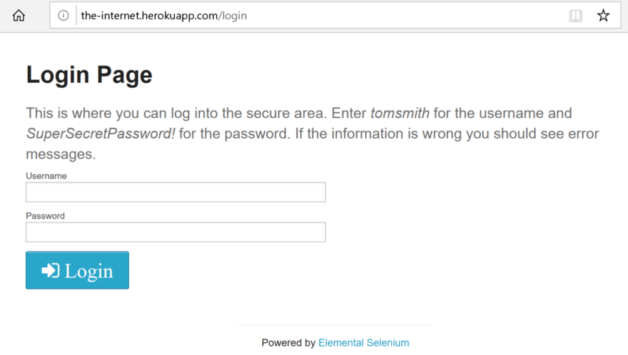

# End-to-End Testing for a Login Form Using Cypress

## [Medium Article](https://levelup.gitconnected.com/environment-variables-in-cypress-end-to-end-testing-e2f20acd6a86)

Cypress provides several ways to work with environment variables. In its documentation about environment variables (link), Cypress has listed their usages, and compared the pros/cons for each option. In this article, we will focus on the option of passing in environment variables using the Cypress command line interface (CLI), and we will discuss scenarios of using the Cypress npm package and Cypress docker images.

## Folder Structure

- `e2e`

  Contains an e2e test for a login process, which requires a username and password.

  We will use environment variables to protect the credentials form leaking to a code repository.

- `cypress-docker-include`

  An example command to run tests using the `cypress/included` image.

- `cypress-docker-base`

  An example `Dockerfile` to build an image based on the `cypress/base` image.

---

